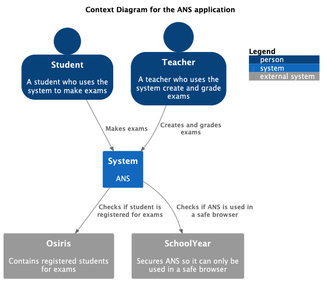

#  C4 Context diagram Weather API

Dit is een context diagram voor de Weather API.

## Zet API keys niet in je Git repo

We lezen alle API keys in via de application.properties een environment variable. Deze sla je NIET op in de git repo, dus deze staat in de `.gitignore` file. Er is wel een `application.template.properties.json` file die je kan kopieren naar `application.properties.json` en daar je eigen api keys in kan zetten.